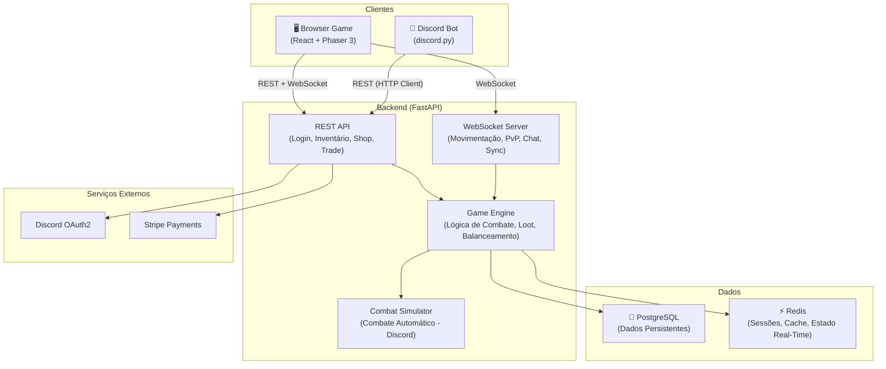
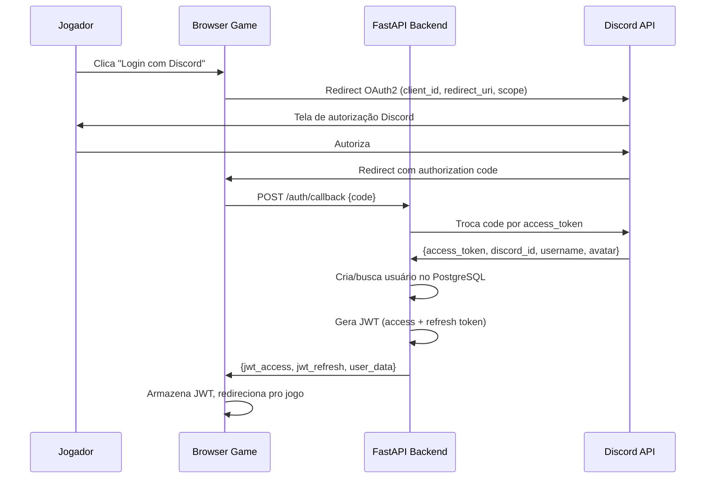
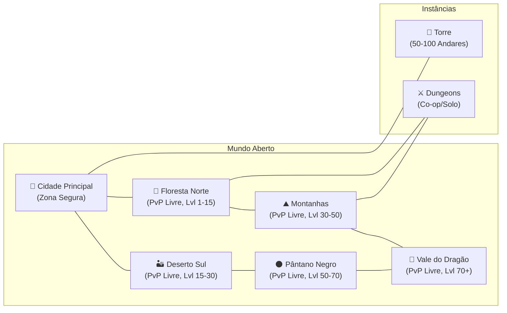
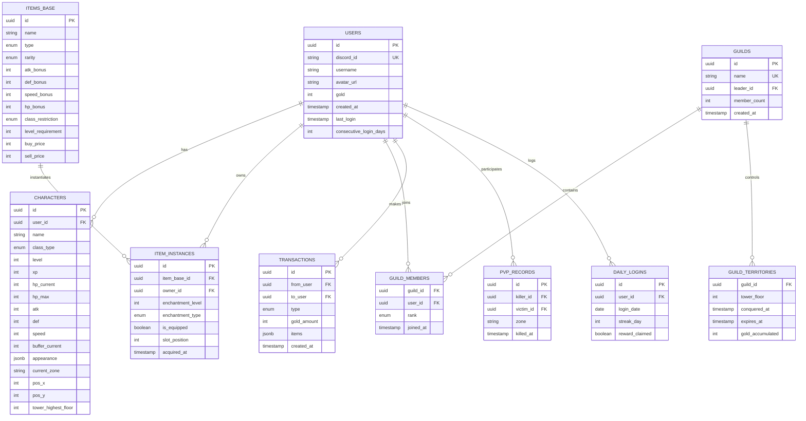

# 🎮 RPG 2D no Navegador + Bot Discord — Plano de Implementação Completo

## Resumo do Projeto

RPG 2D top-down no navegador (PC) com temática de fantasia medieval (estilo Senhor dos Anéis), mapa estilo Tíbia, movimentação grid-based com animação suave, arte em pixel art HD (48x48 / 64x64). O jogo possui modo singleplayer/co-op (história) e multiplayer (PvP aberto). Jogadores no celular acessam via **bot do Discord** com funcionalidades limitadas e combate automático. Ambas as plataformas estão sincronizadas (inventário, gold, XP, personagens, guildas).

---

## 📜 Lore — O Mundo de Gaia

### O Planeta

**Gaia** é um planeta de fantasia e magia, dividido em **4 reinos principais**, cada um com sua cultura, povo e especializações:

| Reino | Descrição | Classe Associada |
|---|---|---|
| 🏰 **Reino dos Homens** | Guerreiros e cavaleiros honrados, mestres do combate corpo a corpo. Seu povo valoriza força, disciplina e lealdade. | Cavaleiro ⚔️ |
| 🔮 **Reino dos Mágicos** | Feiticeiros e necromantes que dominam as artes arcanas. Estudam os mistérios da vida, morte e os planos além do véu. | Necromancer 💀 |
| 🏹 **Reino dos Artesãos** | Inventores, arqueiros e artífices. Mestres em construir armas de precisão, armadilhas e engenhocas. Ágeis e astutos. | Arqueiro 🏹 |
| 👑 **Império de Anathon** | Império maligno e ardiloso que busca dominar todos os reinos e escravizar os povos de Gaia. Governado por um imperador tirano. | — (Inimigo) |

### A História da Revolta

O **Império de Anathon** sempre foi malicioso, maldoso e ardiloso — sempre buscou dominar todos os reinos e tornar todos os povos escravos de sua malícia.

Há **36 anos**, o Imperador cometeu um ato de maldade pura e fria que **expurgou mais de 60% da população** de todos os reinos. Os sobreviventes foram feitos escravos de sua vontade. Clãs inteiros foram dizimados, aldeias reduzidas a cinzas, e a esperança quase se extinguiu de Gaia.

### A Jornada do Personagem

Você é um(a) jovem que foi **exilado(a)** sem saber os motivos. Após anos longe de sua terra natal, você retornou — e encontrou apenas **ruínas**. Sua família e membros queridos foram mortos. Sobraram apenas escombros e uma brisa macabra, carregada de sofrimento e crueldade.

Ao entrar no que costumava ser o **altar de adoração** do seu clã, você viu um pergaminho escondido por escombros — mas que chamava sua atenção e **soava seu nome como um pedido de socorro**.

Ao ler, você soube que foi **escolhido(a)** como o membro que iria restaurar a glória e honra do seu clã.

Confuso(a) e atormentado(a) pelo medo de não ser capaz, você recorre ao **Conselheiro do seu Reino** (definido pela classe escolhida), que explica sua primeira missão: a busca pela sua **primeira armadura de combate e arma**.

### Início do Jogo (por classe)

Antes de iniciar a história, o jogador deve:
1. **Definir a aparência** do personagem (cabelo, pele, olhos)
2. **Escolher a classe** (Cavaleiro, Necromancer ou Arqueiro)
3. **Receber o tutorial base** específico da classe escolhida

Cada classe começa no **reino correspondente** e recebe:

| Classe | Reino Inicial | Arma Inicial | Armadura Inicial | Conselheiro |
|---|---|---|---|---|
| Cavaleiro ⚔️ | Reino dos Homens | Espada de Ferro Enferrujada | Armadura de Couro Reforçada | General Aldric |
| Necromancer 💀 | Reino dos Mágicos | Cajado de Aprendiz | Manto de Iniciado | Arquimago Seraph |
| Arqueiro 🏹 | Reino dos Artesãos | Arco de Caça Simples + Adagas de Treino | Veste de Batedor | Mestre Artífice Kael |

> [!NOTE]
> O tutorial ensina: movimentação, combate básico, uso de inventário, e a primeira quest (buscar a armadura de combate). Cada classe tem um tutorial com inimigos e mecânicas adaptadas ao seu estilo de jogo.

---

## Decisões Técnicas Consolidadas

| Decisão | Escolha |
|---|---|
| **Engine de Jogo** | Phaser 3 (mundo) + React (UI) |
| **Bundler** | Vite |
| **Linguagem Frontend** | TypeScript |
| **CSS** | Tailwind CSS |
| **Backend** | FastAPI (Python) |
| **Comunicação** | WebSocket nativo (FastAPI) + REST |
| **Bot Discord** | discord.py (Pycord) |
| **BD Persistente** | PostgreSQL |
| **BD Cache/Sessão** | Redis |
| **Autenticação** | OAuth2 com Discord como provedor principal |
| **Pagamento** | Stripe |
| **Editor de Mapas** | Tiled Map Editor (TMX) |
| **Repositório** | Monorepo com pastas separadas |
| **Deploy Dev** | Docker Compose local |
| **Arte** | Pixel Art HD (48x48 / 64x64) |

---

## Arquitetura Geral do Sistema



---

## Estrutura do Monorepo

```
rpg-project/
├── 📁 browser-game/              # Frontend - Jogo no Navegador
│   ├── public/
│   │   ├── assets/
│   │   │   ├── sprites/           # Sprites dos personagens (por classe)
│   │   │   ├── tilesets/           # Tilesets pro Tiled
│   │   │   ├── maps/              # Mapas exportados do Tiled (.json)
│   │   │   ├── ui/                # Ícones, frames, botões do jogo
│   │   │   ├── effects/           # Partículas, animações de skill
│   │   │   └── audio/             # SFX e música
│   │   └── favicon.ico
│   ├── src/
│   │   ├── main.tsx               # Entry point React
│   │   ├── App.tsx                # Root component
│   │   ├── vite-env.d.ts
│   │   ├── 📁 config/
│   │   │   ├── game.config.ts     # Configurações do Phaser
│   │   │   ├── api.config.ts      # URLs do backend, WebSocket
│   │   │   └── constants.ts       # Constantes do jogo
│   │   ├── 📁 game/               # === PHASER (Mundo do Jogo) ===
│   │   │   ├── PhaserGame.tsx     # Componente React que monta o Phaser
│   │   │   ├── 📁 scenes/
│   │   │   │   ├── BootScene.ts       # Carregamento de assets
│   │   │   │   ├── PreloadScene.ts    # Loading screen
│   │   │   │   ├── MainMenuScene.ts   # Menu principal (dentro do Phaser)
│   │   │   │   ├── WorldScene.ts      # Mapa do mundo aberto
│   │   │   │   ├── TowerScene.ts      # Andares da torre
│   │   │   │   ├── CombatScene.ts     # Cena de combate PvE/PvP
│   │   │   │   ├── TownScene.ts       # Cidade/zona segura
│   │   │   │   └── DungeonScene.ts    # Masmorras/instâncias
│   │   │   ├── 📁 entities/
│   │   │   │   ├── Player.ts          # Sprite + lógica do jogador
│   │   │   │   ├── OtherPlayer.ts     # Outros jogadores (multiplayer)
│   │   │   │   ├── Monster.ts         # Monstros/NPCs hostis
│   │   │   │   ├── NPC.ts             # NPCs amigáveis (shop, quest)
│   │   │   │   └── Projectile.ts      # Projéteis (flechas, magias)
│   │   │   ├── 📁 systems/
│   │   │   │   ├── MovementSystem.ts      # Movimentação grid-based suave
│   │   │   │   ├── CombatSystem.ts        # Lógica de combate client-side
│   │   │   │   ├── AnimationSystem.ts     # Gerenciador de animações
│   │   │   │   ├── CameraSystem.ts        # Câmera que segue o jogador
│   │   │   │   ├── CollisionSystem.ts     # Colisão com tiles/entidades
│   │   │   │   ├── MinimapSystem.ts       # Mini-mapa
│   │   │   │   └── PredictionSystem.ts    # Client-side prediction
│   │   │   ├── 📁 maps/
│   │   │   │   ├── MapLoader.ts           # Carregador de mapas Tiled
│   │   │   │   ├── MapManager.ts          # Gerenciar transição entre mapas
│   │   │   │   └── TilesetManager.ts      # Gerenciar tilesets
│   │   │   └── 📁 fx/
│   │   │       ├── ParticleEffects.ts     # Efeitos de partículas
│   │   │       └── ScreenEffects.ts       # Screen shake, flash, etc.
│   │   ├── 📁 ui/                 # === REACT (Interface do Jogador) ===
│   │   │   ├── 📁 components/
│   │   │   │   ├── HUD.tsx                # Barra de vida, XP, gold, minimapa
│   │   │   │   ├── Inventory.tsx          # Tela de inventário
│   │   │   │   ├── EquipmentPanel.tsx     # Equipar/desequipar itens
│   │   │   │   ├── SkillBar.tsx           # Barra de habilidades
│   │   │   │   ├── ChatBox.tsx            # Chat multiplayer
│   │   │   │   ├── TradeWindow.tsx        # Janela de trade P2P
│   │   │   │   ├── ShopWindow.tsx         # Loja do NPC
│   │   │   │   ├── EnchantmentPanel.tsx   # Painel de encantamento
│   │   │   │   ├── LootboxModal.tsx       # Animação de abertura de lootbox
│   │   │   │   ├── TowerSelector.tsx      # Seletor de andares da torre
│   │   │   │   ├── GuildPanel.tsx         # Painel da guilda
│   │   │   │   ├── Leaderboard.tsx        # Ranking
│   │   │   │   ├── Minimap.tsx            # Mini-mapa (overlay React)
│   │   │   │   ├── DeathScreen.tsx        # Tela de morte
│   │   │   │   ├── SettingsModal.tsx      # Configurações
│   │   │   │   └── Tooltip.tsx            # Tooltips de itens
│   │   │   ├── 📁 pages/
│   │   │   │   ├── LoginPage.tsx          # Login via Discord OAuth2
│   │   │   │   ├── CharacterCreation.tsx  # Criação de personagem
│   │   │   │   ├── GamePage.tsx           # Página principal (Phaser + UI)
│   │   │   │   └── StorePage.tsx          # Loja de Gold (Stripe)
│   │   │   └── 📁 layouts/
│   │   │       └── GameLayout.tsx         # Layout geral do jogo
│   │   ├── 📁 hooks/              # React Hooks customizados
│   │   │   ├── useWebSocket.ts        # Gerenciar conexão WebSocket
│   │   │   ├── useGameState.ts        # Estado global do jogo
│   │   │   ├── useInventory.ts        # Operações de inventário
│   │   │   ├── useAuth.ts            # Autenticação Discord OAuth2
│   │   │   ├── useTrade.ts           # Operações de trade
│   │   │   └── useChat.ts            # Chat multiplayer
│   │   ├── 📁 store/              # Estado global (Zustand)
│   │   │   ├── gameStore.ts           # Estado principal do jogo
│   │   │   ├── playerStore.ts         # Dados do jogador
│   │   │   ├── inventoryStore.ts      # Estado do inventário
│   │   │   ├── chatStore.ts           # Mensagens do chat
│   │   │   └── uiStore.ts            # Estado da UI (modais, painéis)
│   │   ├── 📁 services/           # Comunicação com backend
│   │   │   ├── api.ts                 # Cliente HTTP (axios/fetch)
│   │   │   ├── websocket.ts           # Cliente WebSocket
│   │   │   ├── authService.ts         # OAuth2 Discord flow
│   │   │   └── stripeService.ts       # Integração Stripe
│   │   ├── 📁 types/              # TypeScript types/interfaces
│   │   │   ├── player.types.ts
│   │   │   ├── item.types.ts
│   │   │   ├── combat.types.ts
│   │   │   ├── map.types.ts
│   │   │   ├── guild.types.ts
│   │   │   ├── websocket.types.ts
│   │   │   └── api.types.ts
│   │   └── 📁 utils/
│   │       ├── gameHelpers.ts
│   │       ├── formatters.ts
│   │       └── validators.ts
│   ├── index.html
│   ├── tailwind.config.ts
│   ├── vite.config.ts
│   ├── tsconfig.json
│   ├── package.json
│   └── .env
│
├── 📁 backend/                    # Backend Compartilhado (FastAPI)
│   ├── app/
│   │   ├── main.py                # Entry point FastAPI
│   │   ├── 📁 api/
│   │   │   ├── 📁 routes/
│   │   │   │   ├── auth.py            # Login/OAuth2/Token refresh
│   │   │   │   ├── players.py         # CRUD jogador, status, level up
│   │   │   │   ├── inventory.py       # Gerenciar inventário
│   │   │   │   ├── combat.py          # Iniciar combate, resultados
│   │   │   │   ├── trade.py           # Criar/aceitar/recusar trade
│   │   │   │   ├── shop.py            # NPC shop (comprar/vender)
│   │   │   │   ├── enchantment.py     # Encantar itens
│   │   │   │   ├── tower.py           # Selecionar andar, entrar, loot
│   │   │   │   ├── lootbox.py         # Abrir lootbox diária/level up
│   │   │   │   ├── guild.py           # CRUD guilda, membros, território
│   │   │   │   ├── leaderboard.py     # Rankings
│   │   │   │   ├── payments.py        # Stripe webhooks, compra de gold
│   │   │   │   └── admin.py           # Endpoints admin (balanceamento)
│   │   │   ├── 📁 websocket/
│   │   │   │   ├── connection_manager.py  # Gerenciar conexões WS
│   │   │   │   ├── game_handler.py        # Handler de eventos do jogo
│   │   │   │   ├── combat_handler.py      # Combate real-time via WS
│   │   │   │   ├── movement_handler.py    # Movimentação/sync via WS
│   │   │   │   ├── chat_handler.py        # Chat multiplayer
│   │   │   │   └── zone_manager.py        # Gerenciar zonas/instâncias
│   │   │   └── deps.py             # Dependências (DB session, auth)
│   │   ├── 📁 core/
│   │   │   ├── config.py              # Settings (env vars)
│   │   │   ├── security.py            # JWT, hashing, OAuth2
│   │   │   ├── database.py            # Conexão PostgreSQL (SQLAlchemy)
│   │   │   ├── redis.py               # Conexão Redis
│   │   │   └── events.py              # Startup/shutdown events
│   │   ├── 📁 models/             # SQLAlchemy Models (PostgreSQL)
│   │   │   ├── user.py                # Conta do jogador (Discord ID)
│   │   │   ├── character.py           # Personagem (classe, stats, level)
│   │   │   ├── inventory.py           # Inventário (slots, itens equipados)
│   │   │   ├── item.py                # Definição de itens (base)
│   │   │   ├── item_instance.py       # Instância de item (com encantamentos)
│   │   │   ├── enchantment.py         # Encantamentos aplicados
│   │   │   ├── guild.py               # Guilda (membros, líder, território)
│   │   │   ├── guild_territory.py     # Territórios dominados na torre
│   │   │   ├── transaction.py         # Histórico de transações (gold)
│   │   │   ├── lootbox.py             # Registro de lootboxes
│   │   │   ├── daily_login.py         # Controle de login diário
│   │   │   └── pvp_record.py          # Histórico de PvP (kills, deaths)
│   │   ├── 📁 schemas/            # Pydantic Schemas (Request/Response)
│   │   │   ├── user.py
│   │   │   ├── character.py
│   │   │   ├── inventory.py
│   │   │   ├── item.py
│   │   │   ├── combat.py
│   │   │   ├── trade.py
│   │   │   ├── guild.py
│   │   │   ├── lootbox.py
│   │   │   ├── enchantment.py
│   │   │   └── websocket.py
│   │   ├── 📁 services/           # Lógica de negócio
│   │   │   ├── auth_service.py        # OAuth2 flow, token management
│   │   │   ├── player_service.py      # Level up, XP, stats
│   │   │   ├── combat_service.py      # Lógica de combate (dano, dodge, crit)
│   │   │   ├── combat_simulator.py    # Simulação automática (Discord)
│   │   │   ├── inventory_service.py   # Gerenciar itens
│   │   │   ├── trade_service.py       # Validar e executar trades
│   │   │   ├── shop_service.py        # Lógica de compra/venda NPC
│   │   │   ├── enchantment_service.py # Lógica de encantamento (RNG, custo)
│   │   │   ├── lootbox_service.py     # Gerar loot (raridades, drop rates)
│   │   │   ├── tower_service.py       # Lógica da torre (dificuldade, boss)
│   │   │   ├── guild_service.py       # Lógica de guilda + territórios
│   │   │   ├── payment_service.py     # Stripe integration
│   │   │   ├── zone_service.py        # Gerenciar zonas/instâncias ativas
│   │   │   └── skull_service.py       # Sistema de skull/PK punishment
│   │   ├── 📁 game/               # Dados do jogo (balanceamento)
│   │   │   ├── classes.py             # Stats base das 3 classes
│   │   │   ├── items_db.py            # Database de itens (base stats)
│   │   │   ├── monsters_db.py         # Database de monstros por zona/andar
│   │   │   ├── enchantments_db.py     # Tabela de encantamentos possíveis
│   │   │   ├── loot_tables.py         # Tabelas de drop (por monstro/boss)
│   │   │   ├── tower_config.py        # Config dos 50-100 andares
│   │   │   ├── xp_table.py            # XP necessário por nível
│   │   │   ├── shop_catalog.py        # Itens vendidos por NPCs
│   │   │   └── formulas.py            # Fórmulas de dano, defesa, crit, etc.
│   │   └── 📁 utils/
│   │       ├── helpers.py
│   │       └── validators.py
│   ├── 📁 migrations/             # Alembic (migrações do banco)
│   │   ├── env.py
│   │   ├── alembic.ini
│   │   └── versions/
│   ├── 📁 tests/
│   │   ├── test_combat.py
│   │   ├── test_inventory.py
│   │   ├── test_trade.py
│   │   ├── test_enchantment.py
│   │   ├── test_lootbox.py
│   │   ├── test_guild.py
│   │   └── test_auth.py
│   ├── requirements.txt
│   ├── Dockerfile
│   ├── .env
│   └── pyproject.toml
│
├── 📁 discord-bot/                # Bot do Discord
│   ├── bot/
│   │   ├── main.py                # Entry point do bot
│   │   ├── 📁 cogs/              # Módulos de comandos (Cogs)
│   │   │   ├── auth_cog.py            # /register, /link, vincular conta
│   │   │   ├── player_cog.py          # /status, /stats, /level
│   │   │   ├── inventory_cog.py       # /inventory, /equip, /unequip
│   │   │   ├── combat_cog.py          # /fight, /pvp @player (automático)
│   │   │   ├── tower_cog.py           # /tower, /climb (automático)
│   │   │   ├── trade_cog.py           # /trade @player item amount
│   │   │   ├── shop_cog.py            # /shop, /buy, /sell
│   │   │   ├── enchant_cog.py         # /enchant item_id material_id
│   │   │   ├── lootbox_cog.py         # /daily, /lootbox
│   │   │   ├── guild_cog.py           # /guild create/invite/kick/territory
│   │   │   └── leaderboard_cog.py     # /ranking, /top
│   │   ├── 📁 views/              # Discord UI Components
│   │   │   ├── combat_view.py         # Embeds de combate automático
│   │   │   ├── inventory_view.py      # Embeds de inventário com botões
│   │   │   ├── trade_view.py          # Embeds de trade com confirmação
│   │   │   ├── shop_view.py           # Embeds de loja com selects
│   │   │   ├── tower_view.py          # Embeds da torre com seletor
│   │   │   ├── lootbox_view.py        # Animação de lootbox (embeds sequenciais)
│   │   │   └── guild_view.py          # Embeds de guilda
│   │   ├── 📁 services/
│   │   │   ├── api_client.py          # HTTP client pro backend FastAPI
│   │   │   └── embed_builder.py       # Helper pra construir embeds bonitos
│   │   ├── 📁 utils/
│   │   │   ├── formatters.py          # Formatação de stats, itens
│   │   │   ├── emojis.py              # Mapeamento de emojis do jogo
│   │   │   └── validators.py
│   │   └── config.py              # Configurações do bot
│   ├── requirements.txt
│   ├── Dockerfile
│   └── .env
│
├── 📁 shared/                     # Schemas e constantes compartilhados
│   ├── constants.py               # IDs de classes, raridades, etc.
│   ├── enums.py                   # Enums (ClassType, Rarity, ItemType)
│   └── game_config.py             # Constantes de balanceamento
│
├── 📁 maps/                       # Arquivos fonte do Tiled Map Editor
│   ├── 📁 tilesets/               # Tilesets (.tsx) originais
│   ├── 📁 world/                  # Mapas do mundo aberto (.tmx)
│   │   ├── town_principal.tmx
│   │   ├── floresta_norte.tmx
│   │   ├── deserto_sul.tmx
│   │   ├── montanhas.tmx
│   │   └── ...
│   ├── 📁 tower/                  # Mapas dos andares da torre (.tmx)
│   │   ├── floor_01.tmx
│   │   ├── floor_02.tmx
│   │   └── ...
│   └── 📁 dungeons/               # Mapas de dungeons (.tmx)
│
├── docker-compose.yml             # PostgreSQL + Redis + Backend + Bot
├── docker-compose.dev.yml         # Override pra desenvolvimento
├── .gitignore
├── .env.example
├── README.md
└── Makefile                       # Comandos úteis (make dev, make migrate, etc.)
```

---

## Sistemas do Jogo — Detalhamento Completo

### 1. 🔐 Sistema de Autenticação

**Fluxo OAuth2 com Discord:**



**Dados armazenados:**
- `users` (PostgreSQL): discord_id, username, avatar_url, created_at, last_login
- `sessions` (Redis): user_id → {jwt, websocket_id, current_zone, online_status} (TTL: 24h)

---

### 2. 🧙‍♂️ Sistema de Classes & Personagem

**3 Classes disponíveis:**

| Stat | Cavaleiro ⚔️ | Necromancer 💀 | Arqueiro 🏹 |
|---|---|---|---|
| **Tipo** | Corpo a corpo | Distância (magia) | Híbrido (arco + adagas) |
| **HP Base** | 210% | 120% | 160% |
| **Dano/Golpe** | Alto | Baixo | Baixo (mas rápido) |
| **Velocidade Ataque** | Lenta | Média | Rápida |
| **Regen HP** | Lenta | Rápida | Rápida |
| **Buffer (golpes)** | 35 | 17 | 25 |
| **Arma Principal** | Espada / Machado | Cajado | Arco |
| **Arma Secundária** | Escudo | — | Dupla de Adagas |
| **Resistência** | Alta (corpo a corpo) | Baixa (corpo a corpo) | Média |

**Equipamento Inicial (recebido no tutorial):**

| Classe | Arma Inicial | Armadura Inicial | Itens Extras |
|---|---|---|---|
| Cavaleiro ⚔️ | Espada de Ferro Enferrujada | Armadura de Couro Reforçada | 3x Poção de Vida Menor |
| Necromancer 💀 | Cajado de Aprendiz | Manto de Iniciado | 3x Poção de Vida Menor, 2x Poção de Mana |
| Arqueiro 🏹 | Arco de Caça + Adagas de Treino | Veste de Batedor | 3x Poção de Vida Menor, 20x Flechas |

**Buffer System:** Após X golpes, o personagem carrega uma habilidade especial (ultimate) que causa dano massivo ou efeito especial baseado na classe.

**Fórmulas base (definidas em `backend/app/game/formulas.py`):**
- `dano_final = (dano_base_arma + dano_bonus_encantamento) * multiplicador_classe * (1 + critical_chance)`
- `dano_recebido = dano_inimigo * (1 - defesa_percentual)`
- `regen_por_tick = hp_max * regen_rate_classe * (1 + bonus_encantamento)`
- `xp_ganho = xp_base_monstro * (1 + bonus_level_diff)`

**Customização visual:**
- 5 opções de cabelo (estilo + cor)
- 4 tons de pele
- 4 cores de olhos
- Roupa inicial baseada na classe

---

### 3. 🗺️ Sistema de Mapa & Mundo Aberto

**Estrutura do mundo (grid-based, tiles 48x48 ou 64x64):**



**Zonas instanciadas:**
- Cada zona suporta 50-100 jogadores simultâneos
- Se a zona enche, cria nova instância da mesma zona
- Jogadores na mesma instância se veem e interagem
- Transição entre zonas: jogador toca na borda → fade out → carrega nova zona

**Camadas do mapa (Tiled):**
1. **Ground** — Chão base (grama, areia, pedra)
2. **Ground Decoration** — Detalhes no chão (flores, poças, trilhas)
3. **Objects** — Árvores, pedras, baús, NPCs (colisão)
4. **Objects Upper** — Copa das árvores, telhados (renderizado acima do jogador = profundidade)
5. **Collision** — Camada invisível de colisão
6. **Spawn Points** — Pontos de spawn de monstros/NPCs (camada de objetos)
7. **Transition Zones** — Áreas de transição entre mapas (camada de objetos)

---

### 4. ⚔️ Sistema de Combate

#### 4.1 Combate Real-Time (Browser)

**Mecânica:**
- Jogador se move pelo mapa e encontra monstros
- Ao entrar em range de ataque, pode atacar com click/tecla
- Cada classe tem range de ataque diferente (melee vs ranged)
- Monstros têm IA básica (patrol, aggro range, attack patterns)
- Dano calculado no servidor (server-authoritative)
- Client-side prediction pra feedback instantâneo

**Fluxo de combate (WebSocket):**
```
Client → Server: {action: "attack", target_id: "monster_123"}
Server valida: jogador está em range? está vivo? cooldown acabou?
Server calcula: dano = formula(atk, def, class, enchantments, crit)
Server → Client: {event: "damage_dealt", target: "monster_123", damage: 45, crit: false}
Server → Client: {event: "hp_update", target: "monster_123", hp: 120/300}
Server → All clients na zona: {event: "entity_hit", entity_id: "monster_123", damage_number: 45}
```

**Buffer/Ultimate System:**
- Cada ataque bem-sucedido incrementa o buffer counter
- Quando o counter atinge o máximo da classe (17/25/35), ultimate fica disponível
- Ultimate tem efeito baseado na classe:
  - **Cavaleiro**: Golpe devastador em área (180° na frente)
  - **Necromancer**: Invoca esqueleto temporário que luta junto
  - **Arqueiro**: Chuva de flechas em área circular

#### 4.2 Combate Automático (Discord Bot)

**Mecânica:**
- Jogador escolhe zona ou andar da torre via slash command
- Servidor simula o combate baseado nos stats do personagem vs monstros
- Resultado é calculado com RNG baseado em: stats, equipamento, encantamentos, nível
- Resultado mostrado como embed no Discord com detalhes

**Fluxo:**
```
Jogador: /fight zona:floresta_norte
Bot → Backend: POST /combat/auto {player_id, zone: "floresta_norte"}
Backend: Simula combate (rolls de dano, loot drops)
Backend → Bot: {result: "victory", xp: 120, gold: 45, loot: ["iron_sword"], hp_remaining: 80%}
Bot → Jogador: Embed bonito com resultado
```

---

### 4.3 🐉 Bestiário — Inimigos & Drops

Inimigos encontrados nas zonas do mundo e nos andares da torre. Cada inimigo tem stats fixos, padrão de ataque, itens dropados e XP concedido.

| Inimigo | ❤️ Vida | ⚔️ Dano | ⏱️ Tempo de Golpe | 🎒 Itens Dropados | ⭐ XP |
|---|---|---|---|---|---|
| **Goblin** | 55 | 23/golpe | 1 golpe a cada 3s | Fragmentos de Ferro, Pequenos Minerais, Pequenas quantidades de Ácido | 30 |
| **Golem** | 110 | 65/golpe | 1 golpe a cada 7s | Pedras, Fragmentos de Minerais | 70 |
| **Caveira** | 23 | 13/golpe | 1 golpe a cada 4s | Esqueleto, Tecido | 25 |
| **Morcegos Elétricos** ×3 | 25 cada (75 total) | 15/golpe por unidade | 1 golpe por unidade a cada 4s | Fragmento de Minério Condutor, Ácido para Poções | 63 |
| **Gárgula** | 65 | 35/golpe | 1 golpe a cada 4s | Fragmentos de Ferro, Dente de Gárgula para Poções | 35 |

> [!IMPORTANT]
> Os **Morcegos Elétricos** são um encontro especial: aparecem sempre em **trio**. Cada morcego ataca independentemente, resultando em até 3 golpes por rodada (45 dano total a cada 4s). São perigosos pra jogadores de baixo nível mas concedem XP generoso (63 XP pelo trio).

**Distribuição por zona:**

| Zona | Inimigos Predominantes | Nível Recomendado |
|---|---|---|
| Floresta Norte | Goblins, Caveiras | 1-15 |
| Deserto Sul | Gárgulas, Golems | 15-30 |
| Montanhas | Golems, Morcegos Elétricos | 30-50 |
| Pântano Negro | Caveiras (elite), Gárgulas (elite) | 50-70 |
| Vale do Dragão | Todos (versão elite) + Dragões | 70+ |

> [!NOTE]
> Versões **elite** dos monstros aparecem em zonas de nível alto com stats multiplicados (2x-3x vida e dano) e drops melhores (chance de raridade Rare+). Bosses da torre terão bestiário próprio detalhado no game design document.

---

### 5. 🗼 Sistema da Torre

**Estrutura: 50-100 andares fixos**

| Faixa de Andares | Dificuldade | Monstros | Boss (a cada 10) | Loot Tier |
|---|---|---|---|---|
| 1-10 | Fácil | Slimes, Goblins | Goblin King | Common-Uncommon |
| 11-20 | Médio | Esqueletos, Lobos | Lich Menor | Uncommon-Rare |
| 21-30 | Difícil | Orcs, Elementais | Orc Warlord | Rare |
| 31-40 | Muito Difícil | Demônios, Espectros | Shadow Lord | Rare-Epic |
| 41-50 | Extremo | Dragões, Titãs | Dragon Emperor | Epic-Legendary |
| 51-100 | Endgame | Escalado | Bosses únicos | Epic-Legendary |

**Mecânica de território (Guild Wars):**
- Cada andar tem 1 slot de território dominável
- Guildas agendam desafio de dominância (10v10 PvP)
- A guilda vencedora domina o andar por 1 semana
- Durante a semana, recebe **40% do gold movimentado** naquele andar por todos os jogadores
- Gold distribuído proporcionalmente entre membros ativos da guilda

**No Discord:** Jogador usa `/tower climb andar:15` → combate automático simulado

---

### 6. 🎒 Sistema de Inventário

**Estrutura:**
- Inventário com **40 slots** (expansível via item especial)
- **6 slots de equipamento**: Arma, Secundária, Capacete, Armadura, Luvas, Botas
- Itens stackáveis: poções, materiais, gold
- Itens únicos: equipamentos (cada um tem stats e encantamentos individuais)

**Raridades de itens:**

| Raridade | Cor | Drop Rate Base | Bonus Stats |
|---|---|---|---|
| Common | ⬜ Branco | 60% | 0-5% |
| Uncommon | 🟩 Verde | 25% | 5-15% |
| Rare | 🟦 Azul | 10% | 15-30% |
| Epic | 🟪 Roxo | 4% | 30-50% |
| Legendary | 🟧 Laranja | 1% | 50-100% |

---

### 6.1 🧱 Materiais de Crafting & Aprimoramento

Materiais são dropados por monstros e usados para aprimorar armaduras, armas e encantamentos. Cada classe precisa de uma combinação específica de materiais para evoluir seu equipamento.

**Materiais base:**

| Material | Fonte Principal | Uso |
|---|---|---|
| 🪨 **Ferro** | Goblins, Gárgulas | Base pra armas e armaduras de metal |
| 🥉 **Bronze** | Golems, baús | Aprimoramento intermediário de equipamentos |
| ⚡ **Minérios Condutores** | Morcegos Elétricos | Encantamentos elétricos, armas mágicas |
| 🪨 **Minérios Básicos** | Golems, mineração | Crafting básico, reforço de armaduras |
| 🧪 **Ácidos** | Goblins, Morcegos Elétricos | Poções, refinamento de materiais |
| 🦷 **Dente de Gárgula** | Gárgulas | Poções especiais, encantamentos raros |
| 🧵 **Tecido** | Caveiras | Armaduras leves, mantos, vestes |
| 🎨 **Corante** | Plantas, NPCs | Customização visual de armaduras |
| 🦴 **Esqueleto** | Caveiras | Crafting de armas necromânticas |
| 💎 **Fragmentos de Minério** | Golems, Morcegos | Gemas de encantamento |

> [!TIP]
> Cada zona do mundo tem concentração diferente de monstros, o que afeta quais materiais são mais fáceis de farmar em cada região. Isso incentiva o jogador a explorar todas as zonas.

---

### 7. 🔮 Sistema de Encantamento

**Mecânica:**
- Jogador coleta **materiais de encantamento** (gemas, essências) de monstros/torre
- Vai ao NPC Encantador ou usa painel no inventário
- Seleciona item + material + paga gold
- RNG determina sucesso:

| Nível | Custo Gold | Materiais | Chance Sucesso | Falha |
|---|---|---|---|---|
| I | 100 | 3 gemas | 90% | Nada acontece |
| II | 300 | 5 gemas + 1 essência | 75% | Reseta pra nível I |
| III | 700 | 10 gemas + 3 essências | 55% | Reseta pra nível I |
| IV | 1500 | 20 gemas + 5 essências + 1 cristal | 35% | Destrói item |
| V | 3000 | 30 gemas + 10 essências + 3 cristais | 15% | Destrói item |

**Tipos de encantamento:**
- **Ataque**: +X% dano
- **Defesa**: +X% redução de dano
- **Velocidade**: +X% velocidade de ataque
- **Vampirismo**: Regen X% do dano causado como HP
- **Crítico**: +X% chance de crítico

---

### 8. 💰 Sistema Econômico

**Moeda única: Gold Coins**

**Fontes de gold (entrada):**
- Matar monstros
- Completar andares da torre
- Vender itens pro NPC
- Lootbox diária
- Compra com dinheiro real (Stripe)

**Saídas de gold (gold sinks):**
- Comprar itens do NPC
- Encantamento (custo + risco de perder item)
- Reparar equipamento (desgaste)
- Criar guilda
- Taxas de trade (% de cada transação)
- Taxa de território (custo pra agendar guild war)

**Integração Stripe:**
```
Pacotes de Gold:
- 500 Gold  → R$ 9,90
- 1200 Gold → R$ 19,90  (bônus 20%)
- 3000 Gold → R$ 44,90  (bônus 50%)
- 7000 Gold → R$ 89,90  (bônus 75%)
```

---

### 9. 🏪 Sistema de Comércio

**Trade P2P (Browser):**
1. Jogador A clica em Jogador B → "Propor Trade"
2. Abre janela de trade com 2 lados
3. Cada jogador arrasta itens + define gold
4. Ambos clicam "Aceitar"
5. Servidor valida (itens existem? gold suficiente?) e executa troca atomicamente

**Trade P2P (Discord):**
```
/trade @jogador item:espada_de_fogo gold:500
```
Bot envia embed pro outro jogador com botões "Aceitar" / "Recusar"

**NPC Shop:**
- NPCs em cidades vendem itens básicos (poções, equipamento common/uncommon)
- NPCs compram itens por 30% do valor base
- Catálogo definido em `backend/app/game/shop_catalog.py`

---

### 10. 🎁 Sistema de Lootbox & Login Diário

**Login Diário (escalonado):**

| Dia | Recompensa |
|---|---|
| Dia 1 | 50 Gold |
| Dia 2 | 2 Poções de Vida |
| Dia 3 | 100 Gold |
| Dia 4 | Lootbox Common |
| Dia 5 | 200 Gold |
| Dia 6 | 5 Gemas de Encantamento |
| Dia 7 | **Lootbox Rare** |
| Dia 14 | **Lootbox Epic** |
| Dia 30 | **Lootbox Legendary** |

**Lootbox por Level Up:**
- Nível 1-20: Lootbox Common
- Nível 21-40: Lootbox Uncommon
- Nível 41-60: Lootbox Rare
- Nível 61-80: Lootbox Epic
- Nível 81+: Lootbox Legendary

**Animação no browser:** Abertura animada estilo gacha com efeitos de partícula baseados na raridade.
**No Discord:** Sequência de embeds mostrando a abertura com emojis e suspense.

---

### 11. 💀 Sistema de PvP Aberto & Skull

**Mecânica (estilo Tíbia):**

- PvP é livre em todas as zonas **exceto cidades** (zonas seguras)
- Ao matar um jogador, o atacante recebe **Skull** (marcação visual)
- Skull types:

| Skull | Condição | Duração | Penalidade |
|---|---|---|---|
| ⬜ White Skull | Atacou jogador | 15 min | Pode ser atacado sem skull |
| 🔴 Red Skull | 3+ kills em 24h | 24h | Perde 2x mais XP ao morrer |
| ⚫ Black Skull | 10+ kills em 48h | 72h | Perde 3x mais XP ao morrer, banido de cidades |

**Ao morrer no PvP:**
- **Perde XP** — percentual de XP perdido depende da zona e do nível do personagem
- **Não perde itens** — inventário e equipamentos permanecem intactos
- Respawna na cidade mais próxima
- Se a perda de XP for suficiente, o jogador pode **perder nível** (desce de level)

| Situação | XP Perdido |
|---|---|
| Morte normal (sem skull) | 5% do XP total do nível atual |
| Morte com White Skull | 8% do XP total do nível atual |
| Morte com Red Skull | 10% do XP total do nível atual (2x) |
| Morte com Black Skull | 15% do XP total do nível atual (3x) |

---

### 12. 🏰 Sistema de Guildas

**Estrutura:**
- Máximo **20 membros** por guilda
- Custo pra criar: 5000 Gold
- Ranks: Líder → Vice-Líder → Oficial → Membro
- Líder pode: promover, rebaixar, expulsar, agendar guild war

**Guild Wars (Territórios da Torre):**
- Qualquer guilda pode desafiar a guilda dominante de um andar
- Desafio agendado (dia/hora específico)
- Formato: **10v10** PvP em arena especial do andar
- Guilda vencedora domina o andar por 1 semana
- Recompensa: **40% do gold total movimentado** naquele andar durante a semana

**No Discord:**
```
/guild create nome:DragonSlayers
/guild invite @jogador
/guild territory   → Lista andares dominados
/guild war andar:25 → Agenda desafio de dominância
```

---

### 13. 🗺️ Sistema de Mini-Mapa

**Browser:**
- Mini-mapa no canto superior direito (React overlay)
- Mostra: jogador (ponto verde), outros jogadores (pontos azuis), monstros (pontos vermelhos), NPCs (pontos amarelos), bordas da zona
- Click no mini-mapa não move o jogador (apenas visualização)
- Pode expandir pra mapa completo com M ou botão

**Discord:**
- Não aplicável (sem visualização em tempo real)
- Bot pode informar zona atual e zonas adjacentes via `/map`

---

### 14. 🤖 Discord Bot — Funcionalidades Detalhadas

**Comandos implementados via Slash Commands:**

| Comando | Descrição | Cog |
|---|---|---|
| `/register` | Vincular conta Discord ao jogo | auth_cog |
| `/status` | Ver stats do personagem | player_cog |
| `/inventory` | Ver inventário (embed com botões de navegação) | inventory_cog |
| `/equip [item]` | Equipar item | inventory_cog |
| `/unequip [slot]` | Desequipar item | inventory_cog |
| `/fight [zona]` | Combate PvE automático | combat_cog |
| `/pvp @jogador` | Desafiar PvP automático | combat_cog |
| `/tower [andar]` | Subir andar da torre (auto) | tower_cog |
| `/trade @jogador [item] [gold]` | Propor trade | trade_cog |
| `/shop` | Ver itens do NPC | shop_cog |
| `/buy [item] [qtd]` | Comprar do NPC | shop_cog |
| `/sell [item] [qtd]` | Vender pro NPC | shop_cog |
| `/enchant [item] [material]` | Encantar item | enchant_cog |
| `/daily` | Coletar lootbox diária | lootbox_cog |
| `/guild [ação]` | Gerenciar guilda | guild_cog |
| `/ranking` | Ver leaderboard | leaderboard_cog |

**Embeds visuais:**
- Cada resposta usa embeds do Discord com cores por raridade
- Botões interativos pra ações (aceitar trade, navegar inventário, confirmar encantamento)
- Emojis customizados pra representar classes, itens, raridades

---

## Schema do Banco de Dados (PostgreSQL)



---

## Dados no Redis (Cache & Estado Efêmero)

| Chave | Tipo | TTL | Dados |
|---|---|---|---|
| `session:{user_id}` | Hash | 24h | jwt, ws_id, zone, online |
| `zone:{zone_name}:players` | Set | — | Set de user_ids na zona |
| `zone:{zone_name}:state` | Hash | — | Monstros vivos, spawns, etc |
| `player:{user_id}:position` | Hash | 5min | x, y, zone, direction |
| `player:{user_id}:combat` | Hash | 10min | Estado de combate ativo |
| `player:{user_id}:cooldowns` | Hash | Variável | Cooldowns de skills |
| `player:{user_id}:skull` | String | 15min-72h | Tipo de skull |
| `pvp:kills:{user_id}` | List | 48h | Timestamps de kills |
| `guild_war:{floor}` | Hash | 1h | Estado da guild war ativa |
| `rate_limit:{user_id}` | Counter | 1min | Rate limiting de requests |
| `matchmaking:queue` | Sorted Set | — | Fila de matchmaking PvP |

---

## Fases de Desenvolvimento (Roadmap)

### 🟢 Fase 1 — Fundação (4-6 semanas)
- [ ] Setup monorepo + Docker Compose (PostgreSQL + Redis)
- [ ] Backend: FastAPI base, modelos SQLAlchemy, Alembic migrations
- [ ] Backend: OAuth2 Discord + JWT
- [ ] Browser: Vite + React + TypeScript setup
- [ ] Browser: Phaser 3 integrado no React
- [ ] Browser: Tela de login (Discord OAuth2)
- [ ] Browser: Criação de personagem (classe + aparência)
- [ ] Browser: Carregamento de mapa Tiled básico + movimentação grid-based
- [ ] Discord Bot: Setup básico + comando /register

### 🟡 Fase 2 — Core Gameplay (6-8 semanas)
- [ ] Backend: Sistema de combate PvE (fórmulas, monstros, loot)
- [ ] Backend: Sistema de inventário (equipar, desequipar, slots)
- [ ] Backend: WebSocket server (movimentação, estado do mundo)
- [ ] Browser: Combate real-time (atacar monstros)
- [ ] Browser: HUD (HP, XP, gold, level)
- [ ] Browser: Inventário + painel de equipamento
- [ ] Browser: Mini-mapa
- [ ] Browser: NPC Shop
- [ ] Discord Bot: /status, /inventory, /fight, /shop

### 🟠 Fase 3 — Multiplayer & PvP (4-6 semanas)
- [ ] Backend: Sincronização multiplayer (ver outros jogadores)
- [ ] Backend: PvP real-time (dano entre jogadores)
- [ ] Backend: Sistema de skull/PK
- [ ] Backend: Zonas instanciadas
- [ ] Browser: Renderizar outros jogadores
- [ ] Browser: PvP (atacar outros jogadores)
- [ ] Browser: Chat multiplayer
- [ ] Discord Bot: /pvp, combate PvP automático

### 🔴 Fase 4 — Economia & Sistemas Avançados (4-6 semanas)
- [ ] Backend: Sistema de trade P2P
- [ ] Backend: Sistema de encantamento (RNG, materiais)
- [ ] Backend: Sistema de lootbox + login diário
- [ ] Backend: Torre (50+ andares, bosses, dificuldade)
- [ ] Browser: Janela de trade
- [ ] Browser: Painel de encantamento
- [ ] Browser: Animação de lootbox
- [ ] Browser: Seletor de andares da torre
- [ ] Discord Bot: /trade, /enchant, /daily, /tower

### 🟣 Fase 5 — Guildas & Endgame (3-4 semanas)
- [ ] Backend: Sistema de guildas (CRUD, membros, ranks)
- [ ] Backend: Territórios + Guild Wars (10v10)
- [ ] Backend: Leaderboard
- [ ] Browser: Painel de guilda
- [ ] Browser: Leaderboard UI
- [ ] Discord Bot: /guild, /ranking

### ⚫ Fase 6 — Monetização & Polish (2-3 semanas)
- [ ] Backend: Integração Stripe (pacotes de gold)
- [ ] Browser: Loja de gold (Stripe Checkout)
- [ ] Browser: Polish visual (efeitos, animações, transições)
- [ ] Testes de carga (WebSocket, combate massivo)
- [ ] Balanceamento de economia (gold sources vs sinks)
- [ ] Deploy em cloud

---

## Stack Final Consolidada

| Componente | Tecnologia |
|---|---|
| **Frontend Game Engine** | Phaser 3 |
| **Frontend UI** | React 18+ |
| **Frontend Build** | Vite |
| **Frontend Linguagem** | TypeScript |
| **Frontend CSS** | Tailwind CSS |
| **Frontend State** | Zustand |
| **Backend Framework** | FastAPI |
| **Backend Linguagem** | Python 3.11+ |
| **Backend ORM** | SQLAlchemy 2.0 + Alembic |
| **Backend WebSocket** | FastAPI nativo (starlette) |
| **Discord Bot** | discord.py (Pycord) |
| **BD Persistente** | PostgreSQL 16 |
| **BD Cache** | Redis 7 |
| **Autenticação** | OAuth2 Discord + JWT |
| **Pagamentos** | Stripe |
| **Editor de Mapas** | Tiled Map Editor |
| **Containers** | Docker + Docker Compose |
| **HTTP Client** | Axios (frontend), httpx (bot) |

---

## Plano de Verificação

### Testes Automatizados
```bash
# Backend
cd backend && pytest tests/ -v

# Frontend
cd browser-game && npm run test

# Bot
cd discord-bot && pytest tests/ -v
```

### Verificação Manual
- [ ] Login via Discord OAuth2 funciona no browser
- [ ] Personagem se move suavemente no grid
- [ ] Monstros spawnam e podem ser atacados
- [ ] Inventário funciona (equipar, desequipar)
- [ ] Outros jogadores aparecem e se movem na mesma zona
- [ ] PvP funciona em zonas não-seguras
- [ ] Trade P2P funciona entre 2 jogadores
- [ ] Encantamento funciona com RNG
- [ ] Lootbox diária funciona
- [ ] Torre: seletor de andar + combate + boss
- [ ] Discord Bot: todos os slash commands funcionam
- [ ] Sincronização: ação no Discord reflete no browser e vice-versa
- [ ] Pagamento Stripe: compra de gold funciona
- [ ] Guild War: 10v10 funciona e território é atualizado
